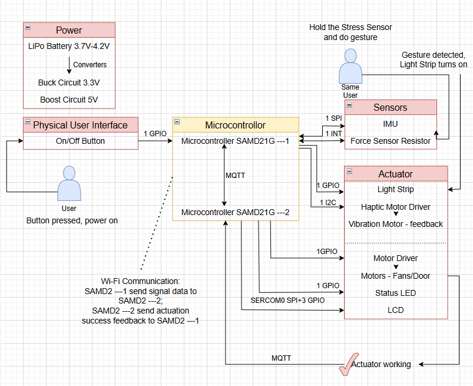
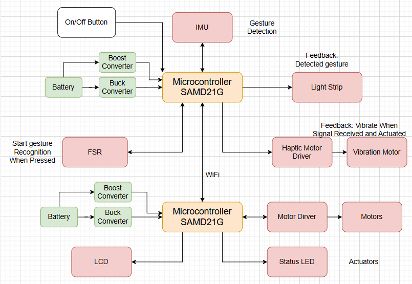
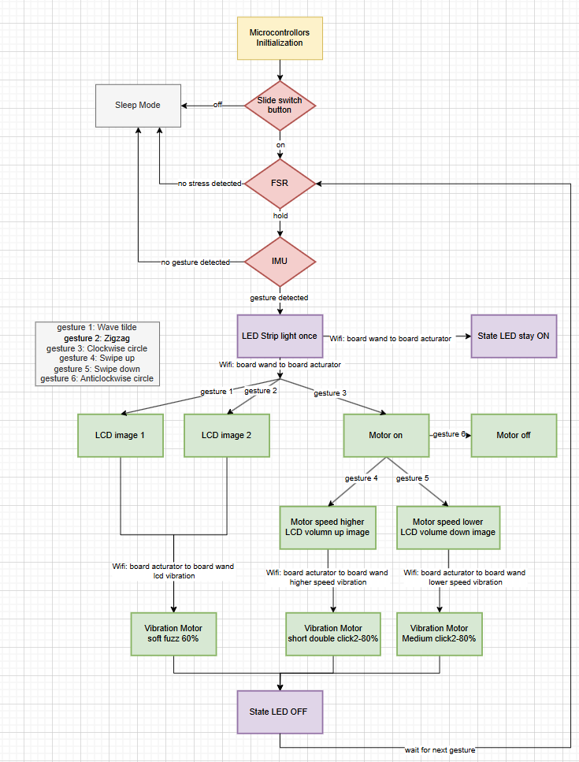

# a07g-exploring-the-CLI

* Team Number: T05
* Team Name: Fusion Maverick
* Team Members: Qingyang Xu, Ruizhe Wang, Xinyi Wang
* GitHub Repository URL: https://github.com/ese5160/final-project-a07g-a14g-t05-fusion-maverick.git
* Description of test hardware: (development boards, sensors, actuators, laptop + OS, etc)

 

## 1. Software Architecture
<b><i>1. Updated HRS & SRS are elaborated below.</i></b>
* <b><i>HRS:</i></b>
    * <u><i>Magic Wand PCBA:</i></u>
        * HR01 - project shall be based on SAMW25 core.

        * HR02 - external-connected slide switch shall be used for activation of the wand.

        * HR03 - external-connected Force-Sensitive Resistor(FSR) Interlink Model 402 shall be used for for command detection.  
        The sensor will detect if continuous force exerted in the sensing area, as a start flag and maintaining state for the wand gesture recognition.

        * HR04 - mounted 6-axis IMU MPU6500 shall be used for for wand gesture recognition.  
        The sensor will collect 6-axis data(3-axis gyroscope and 3-axis accelerometer) while the FSR sensing area is continuously pressed. 
        The collected data shall be then used to recognize the swing trajectory of the wand for gesture recognition.
        The tentative way we've designed for gestures are: 
        gesture 1: Wave tilde---wave pattern; 
        gesture 2: Zigzag---twinkle; 
        gesture 3: Clockwise circle---Turn on the motor; 
        gesture 4: Swipe up---Speed up the motor and LCD shows volume up animation; 
        gesture 5: Swipe down---Slow down the motor and LCD shows volume down animation; 
        gesture 6: Anticlockwise circle---Turn off the motor;

        * HR05 - external-connected LED strip shall be used for command emission indication. 
        The LED strip will quickly flash simultaneously as the control command sent out via MQTT to the cloud, imitating the laser emission process.

        * HR06 - external-connceted vibration motor drived by DRV2605L haptic motor controller shall be used for actuator execution feedback. 
        The vibration motor will funtion as a feedback reponse to different actuators' actions. The tentative way we're going to execute it is:
            * LCD tasks---Vibration Motor soft fuzz 60%;
            * Motor speed up task---Vibration Motor short double click2-80%;
            * Motor slow down task---Vibration Motor medium click2-80%.

     

    * <u><i>Acuator PCBA:</i></u>
        * HR07 - project shall be based on SAMW25 core.

        * HR08 - mounted state LED shall be used to reflect the state of the actuator.  
        If there is no control demand, the state LED maintains off; vice versa, the state LED will be turned on when instruction send until the task execution.

        * HR09 - external-connected gearmotor drived by DRV8874 motor driver shall be used as one of the actuator. 
        The motor will be drived to execuate the wand command. Such as clockwise to turn on, swipe up to increase the rotation speed, swipe down to decrease the rotation, and anticlockwise to turn off.

        * HR010 - external-connected LCD shall be used as the other actuator. 
        The LCD would have two function modes, one is the visulization of motor control, which would reflect the motion state of the motor, such as, as the rotation speed increase, the LCD will display volume up animation. 
        In addition, the LCD would solely interact with the magic wand, such as the LCD will antimate a wave pattern when wand has a 'Tilde' tranjectory gesture, and animate a twinkle with respect to wand 'Zigzag' tranjectory gesture.

 

* <b><i>SRS:</i></b>
    * SR01 - slide switch on/off. 
        - configured as an external interrupt;
        - programmed state machine controlling the entire state(ON/OFF) of the system.
    
     

    * SR02 - FSR based command detection. 
        - configured as an external interrupt;
        - a FSR will be used to monitor the use condition of the wand:
            - if no strain/stress detected(<b><i>logic 'high'</i></b>), the wand is a common stick used for fun;
            - if concontinuous strain/stress detected(<b><i>logic 'low'</i></b>), the wand is utilized as our proposed "magic wand".

     

    * SR03 - IMU-based gesture recognition. 
        - configued as a SPI(SERCOM0) + one external interrupt;
        - the 6-axis IMU MPU6500 will be used for collecting data when the user touches the sensing area of the strain/stress sensor until no strain/stress detected at that area or stopping swinging of the wand; 
        the collected data will be used for the recognition of trajectory gestures of the wand, and then send out the correspoding control demand to the cloud.

     

    * SR04 - LED strip based command emission. 
        - configued as a digital output;
        - a LED strip will be programmed to flash simultaneously when the control demand is sent out after correct gesture recogonition. 
        Neopixel library will be utilized for this implmentation.

     

    * SR05 - actuartor execution.
        - the corresponding actuator(determined by the pre-defined gestures) will response to the magic wand instruction, execute the command and send feedback to the cloud to actiavte the vibration motor on the wand; 
            * state LED(configued as a a digital output): keep off while no command, turned on when received the command and turned off when the tasks are successfully executed.
            * motor(drived by DRV8874 motor driver, configued as several digital I/Os):
                * activation: clockwise circle drawn by the wand;
                * brake: anticlockwise circle drawn by the wand;
                * accelerate: wand swipes up;
                * decelerate: wand swipes down.
            * LCD(configued as a SPI(SERCOM0) + several digital I/Os):
                * mode 1: visulization of motor motion state:
                    * motor accelerates: volume up animation;
                    * motor decelerates: volume down animation.
                * mode 2: intaction with wand: 
                the LCD would solely interact with the wand. For instance, the LCD will animate a twinkle with respect to wand 'Zigzag' tranjectory gesture; the LCD will angimate a wave pattern with respect to wand Tilde' tranjectory gesture.

     
        
    * SR06 - vibration motor based actuator exection feedback. 
        - drived by DRV2605L haptic motor controller, configured as an I2C(SERCOM3) + one digital output
        - a vibration motor will be activated for about few seconds once the control demand has been successfully received and executed by the actuator. We proposed varying vibration effects/modes of the motor with respect to diffrent task accomplishment. The tentative way we're going to execute it is:
            * LCD tasks---Vibration Motor soft fuzz 60%;
            * Motor speed up task---Vibration Motor short double click2-80%;
            * Motor slow down task---Vibration Motor medium click2-80%;

 
 

<b><i>2. Block diagrams are shown below.</i></b>

 
 

<b><i>3. Flowchart illusatration is shown below.</i></b>

## 2. Understanding the Starter Code

<b><i> 1. What does “InitializeSerialConsole()” do? In said function, what is “cbufRx” and “cbufTx”? What type of data structure is it? </i></b>

* The function InitializeSerialConsole() initializes the UART for serial communication by setting up circular buffers for receiving (cbufRx) and transmitting (cbufTx) data, configuring the USART module and its callbacks, setting interrupt priority, and initiating a read operation to enable continuous data reception. The circular buffers are created using circular_buf_init(), which allocates memory for storing serial data before it is processed.

* cbufRx and cbufTx are circular buffers, a type of FIFO (First-In, First-Out) data structure that allows efficient handling of continuous data streams. This structure enables smooth serial communication by storing incoming and outgoing data in a fixed-size buffer where the read and write pointers wrap around when they reach the buffer’s end. Circular buffers help prevent data loss, making them ideal for asynchronous serial data handling in embedded systems.

<b><i> 2. How are “cbufRx” and “cbufTx” initialized? Where is the library that defines them (please list the *C file they come from). </i></b>

* The variables cbufRx and cbufTx are initialized in the function InitializeSerialConsole() using the function circular_buf_init(). This function is called with two parameters: a pointer to a character buffer (rxCharacterBuffer for cbufRx and txCharacterBuffer for cbufTx) and the respective buffer sizes (RX_BUFFER_SIZE and TX_BUFFER_SIZE). This setup effectively creates circular buffers for handling received and transmitted data in the serial communication process.

* The circular_buf_init() function is defined in circular_buffer.c, with its corresponding declarations in circular_buffer.h. This library implements a circular buffer (ring buffer) structure, enabling efficient handling of serial data by maintaining a FIFO (First-In, First-Out) queue. The SerialConsole.c file, which contains the InitializeSerialConsole() function, utilizes this library to initialize and manage the serial console’s buffers.

<b><i> 3. Where are the character arrays where the RX and TX characters are being stored at the end? Please mention their name and size.
Tip: Please note cBufRx and cBufTx are structures. </i></b>

* rxCharacterBuffer – This array stores the received characters (RX). 
Size: RX_BUFFER_SIZE (512 bytes). 
Defined in: SerialConsole.c.

* txCharacterBuffer – This array stores the transmitted characters (TX). 
Size: TX_BUFFER_SIZE (512 bytes). 
Defined in: SerialConsole.c.

<b><i> 4. Where are the interrupts for UART character received and UART character sent defined?</i></b> 

<b><i> 5. What are the callback functions that are called when:  
a. A character is received? (RX) 
b. A character has been sent? (TX) </i></b>

<b><i> 6. Explain what is being done on each of these two callbacks and how they relate to the cbufRx and cbufTx buffers.</i></b> 

<b><i> 7. Draw a diagram that explains the program flow for UART receive – starting with the user typing a character and ending with how that characters ends up in the circular buffer “cbufRx”. Please make reference to specific functions in the starter code. </i></b>

<b><i> 8. Draw a diagram that explains the program flow for the UART transmission – starting from a string added by the program to the circular buffer “cbufTx” and ending on characters being shown on the screen of a PC (On Teraterm, for example). Please make reference to specific functions in the starter code. </i></b>

<b><i> 9. What is done on the function “startStasks()” in main.c? How many threads are started?</i></b>

 

## 3. Debug Logger Module 

 

## 4. Wiretap the convo!

 

## 5. Complete the CLI

 

## 6. Add CLI commands

 

## 7. Using Percepio